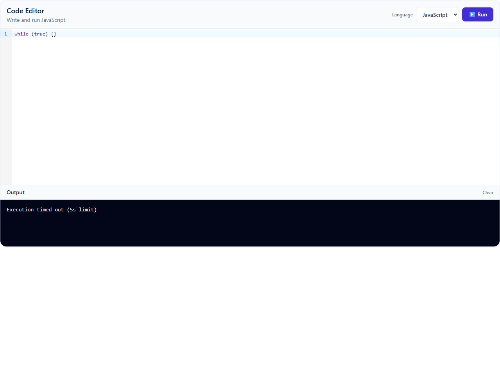
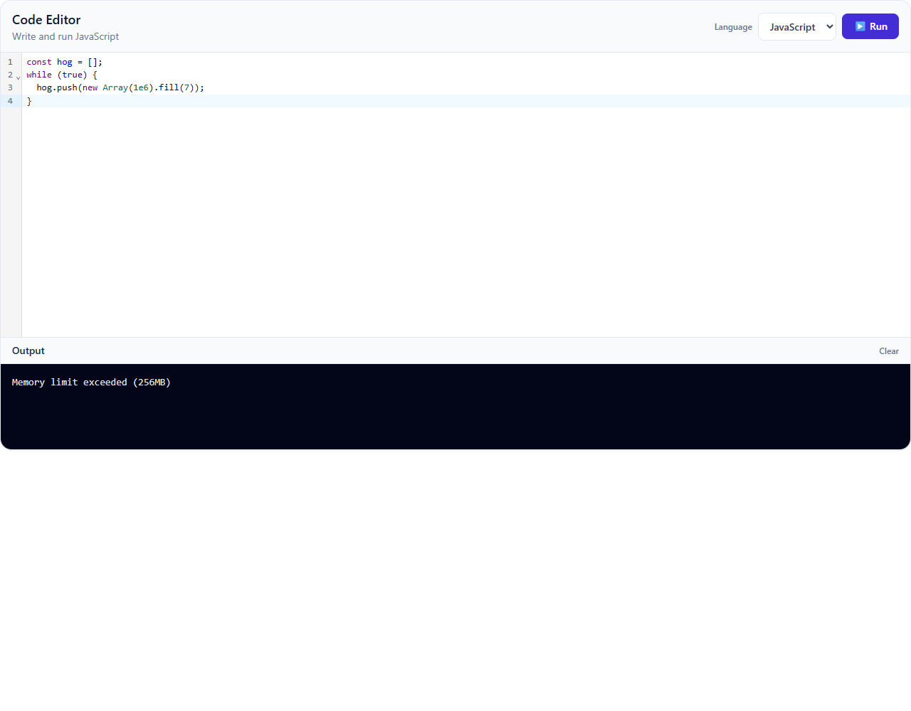

# Self-hosted Piston — setup guide

The public Piston instance at `emkc.org` went offline on 31 Aug 2026 and now
answers `401` to every request, including `/runtimes`. To run code locally you
need your own Piston container. This guide takes you from nothing to a working
runner in about ten minutes.

Everything below is Windows-first, because that is where the sharp edges are.
macOS and Linux users can skip to [Start the container](#2-start-the-container).

---

## 1. Prerequisites

### Docker Desktop

Install [Docker Desktop](https://www.docker.com/products/docker-desktop/) and
make sure it actually starts. Piston runs `isolate` inside a privileged
container, so there is no Docker-less fallback.

### Windows: WSL2 + VirtualMachinePlatform

Docker Desktop on Windows runs on WSL2, which needs two optional Windows
features enabled. Open **PowerShell as Administrator** and run:

```powershell
dism.exe /online /enable-feature /featurename:Microsoft-Windows-Subsystem-Linux /all /norestart
dism.exe /online /enable-feature /featurename:VirtualMachinePlatform /all /norestart
```

Reboot afterwards — `/norestart` means the features are staged but not live
until you do.

### Windows: CPU virtualization

Virtualization must be enabled in your BIOS/UEFI (called **Intel VT-x**,
**AMD-V**, or just **SVM Mode** depending on the vendor). Check it without
rebooting:

```powershell
Get-ComputerInfo -Property HyperVRequirementVirtualizationFirmwareEnabled
```

If that reports `False`, reboot into BIOS/UEFI and turn it on. Docker Desktop
will refuse to start otherwise.

---

## 2. Start the container

Two commands. Run them in order.

```bash
docker volume create piston_data
```

```bash
docker run -d --name piston_api -p 2000:2000 --privileged -v piston_data:/piston -e PISTON_RUN_TIMEOUT=5000 -e PISTON_RUN_CPU_TIME=5000 -e PISTON_COMPILE_TIMEOUT=10000 -e PISTON_COMPILE_CPU_TIME=10000 -e PISTON_RUN_MEMORY_LIMIT=268435456 -e PISTON_COMPILE_MEMORY_LIMIT=268435456 -e PISTON_OUTPUT_MAX_SIZE=65536 ghcr.io/engineer-man/piston
```

It is one long line on purpose — `\` continuations break in PowerShell, which
wants a backtick instead.

What each flag is doing:

| Flag | Why |
| --- | --- |
| `-d` | Detached, so it keeps running after you close the terminal. |
| `--name piston_api` | Stable name for `docker start piston_api` / `docker logs piston_api`. |
| `-p 2000:2000` | Exposes the API on `localhost:2000`. |
| `--privileged` | Required. `isolate` needs cgroup and namespace control. |
| `-v piston_data:/piston` | Persists installed runtimes across restarts. |
| `-e PISTON_*` | Raises the ceilings so the backend's own limits fit inside them. See below. |

### ⚠️ The `-e` flags are not optional

Piston treats the per-request limits the backend sends as *requests*, and
**rejects the entire execution** if any exceeds the ceiling the container was
started with:

```json
{"message":"run_timeout cannot exceed the configured limit of 3000"}
```

The stock image ships `run_timeout` and `run_cpu_time` at **3000ms**, but the
backend asks for 5000 (see §6). Start the container without these flags and
*every* run fails — not just slow ones. The backend turns that specific
rejection into a message naming the fix, so if you see "the code runner is
configured with lower limits than this server asks for", this is what it means.

Two ceilings, not one: `run_timeout` is wall-clock and `run_cpu_time` is CPU
time, enforced independently. Raising only the first leaves a busy loop dying at
3s CPU while the UI claims a 5s limit, so they are set together. `268435456` is
256MB in bytes.

`PISTON_OUTPUT_MAX_SIZE` is a different kind of fix. The image default is
**1024 bytes**, and a program that prints past it is killed with its output
*discarded* — around 200 lines of `print()` is enough, and the user sees an
empty panel. 64KB is roomy enough for ordinary student programs while still
bounding the response.

If your container is already running without them, recreate it — the
`piston_data` volume means you will **not** have to reinstall the runtimes:

```bash
docker rm -f piston_api
docker run -d --name piston_api -p 2000:2000 --privileged -v piston_data:/piston -e PISTON_RUN_TIMEOUT=5000 -e PISTON_RUN_CPU_TIME=5000 -e PISTON_COMPILE_TIMEOUT=10000 -e PISTON_COMPILE_CPU_TIME=10000 -e PISTON_RUN_MEMORY_LIMIT=268435456 -e PISTON_COMPILE_MEMORY_LIMIT=268435456 -e PISTON_OUTPUT_MAX_SIZE=65536 ghcr.io/engineer-man/piston
```

Check it came up:

```bash
docker ps --filter name=piston_api
docker logs piston_api
```

### ⚠️ The named volume is mandatory on Windows

Use the **named volume** (`-v piston_data:/piston`). Do **not** bind-mount a
Windows folder:

```bash
# Do NOT do this on Windows
docker run -d --name piston_api -p 2000:2000 --privileged -v C:\piston:/piston ghcr.io/engineer-man/piston
```

A bind-mounted Windows path is backed by NTFS through a translation layer that
cannot represent the ownership and permission bits `isolate` sets up for its
sandboxes. The container starts, but every execution fails with a
**read-only filesystem** error, and package installs fail the same way. It looks
like a permissions bug in Piston; it is not. A named volume lives inside the
Linux VM on ext4 and has none of these problems.

If you already hit this, start clean:

```bash
docker rm -f piston_api
docker volume create piston_data
docker run -d --name piston_api -p 2000:2000 --privileged -v piston_data:/piston -e PISTON_RUN_TIMEOUT=5000 -e PISTON_RUN_CPU_TIME=5000 -e PISTON_COMPILE_TIMEOUT=10000 -e PISTON_COMPILE_CPU_TIME=10000 -e PISTON_RUN_MEMORY_LIMIT=268435456 -e PISTON_COMPILE_MEMORY_LIMIT=268435456 -e PISTON_OUTPUT_MAX_SIZE=65536 ghcr.io/engineer-man/piston
```

---

## 3. Install runtimes over HTTP

This image ships **no `piston` CLI** — `docker exec piston_api piston pkg install ...`
will tell you the command does not exist. Runtimes are installed by POSTing to
the package API instead.

```bash
curl -X POST http://localhost:2000/api/v2/packages -H "Content-Type: application/json" -d "{\"language\":\"node\",\"version\":\"20.11.1\"}"
```

```bash
curl -X POST http://localhost:2000/api/v2/packages -H "Content-Type: application/json" -d "{\"language\":\"python\",\"version\":\"3.12.0\"}"
```

```bash
curl -X POST http://localhost:2000/api/v2/packages -H "Content-Type: application/json" -d "{\"language\":\"gcc\",\"version\":\"10.2.0\"}"
```

```bash
curl -X POST http://localhost:2000/api/v2/packages -H "Content-Type: application/json" -d "{\"language\":\"java\",\"version\":\"15.0.2\"}"
```

Each call downloads and unpacks a package. Success looks like:

```json
{"language":"node","version":"20.11.1"}
```

Two things worth knowing before you start:

- **One `gcc` package gives you both C and C++.** There is no separate `c` or
  `cpp` package — installing `gcc` registers `c`, `c++`, `d` and `fortran` as
  runtimes in one go. We use the first two; the others are harmless.
- **`gcc` and `java` are large and slow.** Node and Python land in a minute or
  two, but these two are several hundred MB each and can take **several
  minutes**. The request just sits there with no progress output — that is
  normal, do not kill it. If you want to watch it work, tail the container logs
  in a second terminal (see §5).

To see what versions are installable:

```bash
curl http://localhost:2000/api/v2/packages
```

---

## 4. Verify

List what is installed:

```bash
curl http://localhost:2000/api/v2/runtimes
```

With all four packages in, you should see seven runtimes — the five we use plus
the two extras `gcc` throws in:

| `language` | `version` | aliases | from package |
| --- | --- | --- | --- |
| `javascript` | 20.11.1 | `js`, `node-js`, `node-javascript` | node |
| `python` | 3.12.0 | `py`, `py3`, `python3` | python |
| `c` | 10.2.0 | `gcc` | gcc |
| `c++` | 10.2.0 | `cpp`, `g++` | gcc |
| `java` | 15.0.2 | — | java |
| `d` | 10.2.0 | `gdc` | gcc (unused) |
| `fortran` | 10.2.0 | `f90` | gcc (unused) |

### Per-language smoke tests

One `curl` per language. Each should answer `"code":0` with the matching
greeting on `run.stdout`. These are copy-paste ready for bash / Git Bash — the
JSON body is single-quoted so nothing in it gets mangled by the shell.

| Language | Command |
| --- | --- |
| JavaScript | <code>curl -X POST http://localhost:2000/api/v2/execute -H "Content-Type: application/json" -d '{"language":"js","version":"*","files":[{"content":"console.log(\"hello from js\")"}]}'</code> |
| Python | <code>curl -X POST http://localhost:2000/api/v2/execute -H "Content-Type: application/json" -d '{"language":"python","version":"*","files":[{"content":"print(\"hello from python\")"}]}'</code> |
| C | <code>curl -X POST http://localhost:2000/api/v2/execute -H "Content-Type: application/json" -d '{"language":"c","version":"*","files":[{"name":"main.c","content":"#include &lt;stdio.h&gt;\nint main(){puts(\"hello from c\");return 0;}"}]}'</code> |
| C++ | <code>curl -X POST http://localhost:2000/api/v2/execute -H "Content-Type: application/json" -d '{"language":"c++","version":"*","files":[{"name":"main.cpp","content":"#include &lt;iostream&gt;\nint main(){std::cout&lt;&lt;\"hello from c++\"&lt;&lt;std::endl;return 0;}"}]}'</code> |
| Java | <code>curl -X POST http://localhost:2000/api/v2/execute -H "Content-Type: application/json" -d '{"language":"java","version":"*","files":[{"name":"Main.java","content":"public class Main{public static void main(String[] a){System.out.println(\"hello from java\");}}"}]}'</code> |

A pass looks like this (Python shown):

```json
{"run":{"stdout":"hello from python\n","stderr":"","code":0,"signal":null}}
```

Notes on the payloads above:

- `"version":"*"` asks Piston for whatever it has installed, which is what the
  backend sends too — so these test the same path the app uses.
- Use the language names in the table: `js`, `python`, `c`, `c++`, `java`. Piston
  matches aliases, but `cpp` and `c++` are *both* accepted while `csharp` or
  `cplusplus` are not — stick to the ones listed.
- C and Java need a `name` (`main.c`, `Main.java`); Java in particular requires
  the filename to match the public class. JS and Python can omit it.
- The C test uses `puts()` rather than `printf("...\n")` on purpose: a `\n`
  inside the C string has to be double-escaped as `\\n` through JSON, and it is
  the single most common way to get a bogus *missing terminating " character*
  compile error out of a hand-written test payload.

---

## 5. Verify backend–Piston communication

The smoke tests prove Piston works. This proves *your backend is talking to it*
— which is the part that actually breaks, usually because `PISTON_URL` is wrong
or Docker is not running.

Tail the container while you use the app:

```bash
docker logs --tail 20 -f piston_api
```

Drop the `-f` for a one-shot look at the last 20 lines.

Now hit **Run** in the code editor (or fire one of the smoke tests above). A
healthy request writes **three lines per execution**:

```
2026-09-07T16:05:47.489Z [INFO]  job/a15cc371-fdf0-4d2f-9a26-ccff2aa67a19: Priming job
2026-09-07T16:05:47.500Z [INFO]  job/a15cc371-fdf0-4d2f-9a26-ccff2aa67a19: Executing job runtime=python-3.12.0
2026-09-07T16:05:47.583Z [INFO]  job/a15cc371-fdf0-4d2f-9a26-ccff2aa67a19: Cleaning up job
```

(The real output is ANSI-coloured; the job UUID ties the three lines together,
so with concurrent users you will see them interleaved.)

Read it like this:

- **`Priming job`** — the request arrived and Piston allocated a sandbox. Seeing
  this at all means the backend reached the container: URL, port and Docker are
  all fine.
- **`Executing job runtime=python-3.12.0`** — which runtime got selected. This is
  where you confirm `"*"` resolved to the version you expect. Switch languages in
  the editor and you should see `runtime=` change to `javascript-20.11.1`,
  `c-10.2.0`, `c++-10.2.0`, `java-15.0.2`.
- **`Cleaning up job`** — sandbox torn down. Its absence means a job hung.

**If nothing appears in the logs at all**, the request never left your backend.
Piston is not the problem — check `PISTON_URL` in `backend/.env`, confirm the
backend was restarted after you edited it, and look at the backend's own console
for a `503 ... service is unreachable`.

---

## 6. Backend config

Add this to `backend/.env` (that file is gitignored — `.env.example` carries the
placeholder for the team):

```
PISTON_URL=http://localhost:2000
```

Give it the **base URL**, not the endpoint. `codeExecutionService.js` appends
`/api/v2/execute` itself, and tolerates either form — a trailing slash or a full
`.../api/v2/execute` URL both resolve to the same place — so there is no way to
get this subtly wrong.

Restart the backend after editing `.env` — dotenv only reads it at boot.

### Sandbox resource limits

Every execution is sent with limits attached, so a runaway program is killed by
the runner instead of tying up a worker. The defaults need no `.env` entry:

| `.env` variable | Default | Sent to Piston as |
| --- | --- | --- |
| `EXEC_RUN_TIMEOUT_MS` | `5000` | `run_timeout` + `run_cpu_time` |
| `EXEC_COMPILE_TIMEOUT_MS` | `10000` | `compile_timeout` + `compile_cpu_time` |
| `EXEC_MEMORY_LIMIT_MB` | `256` | `run_memory_limit` + `compile_memory_limit` |

Three things follow from how Piston enforces these:

- **Each maps to two ceilings, not one.** Wall-clock and CPU time are separate
  and independently enforced. A busy loop burns both; `sleep(10)` burns only
  wall clock. Sending just one would let a program die at a limit different from
  the one we advertise, so the service sends both.
- **The container ceiling wins.** These values must fit inside the `-e PISTON_*`
  flags from §2, or Piston rejects the request outright. Raising a value here
  without raising it there breaks every execution.
- **`PISTON_TIMEOUT_MS` is floored automatically.** Our own HTTP timeout is held
  at no less than compile + run + 5s, so axios can never abort a job the sandbox
  was about to kill and report properly.

Hitting a limit is not an error the user has to decode — the API returns
`limitExceeded` (`"timeout"` / `"memory"` / `"killed"`) plus a ready-to-display
`limitError`, and the Output panel shows exactly that:

```
Execution timed out (5s limit)
Memory limit exceeded (256MB)
```

Raw signals, exit code 137 and shell noise like `line 3: 3 Killed` are mapped
away and never reach the user. Any `stdout` the program produced before it was
killed is still shown above the message.

### How the five languages map through

The dropdown in `CodeEditor.jsx` offers five languages. Each maps through
`LANGUAGE_MAP` in `codeExecutionService.js` to a Piston runtime:

| Editor option | `LANGUAGE_MAP` key | sent as `language` | filename | needs package |
| --- | --- | --- | --- | --- |
| JavaScript | `javascript` | `javascript` | `main.js` | node |
| Python | `python` | `python` | `main.py` | python |
| C | `c` | `c` | `main.c` | gcc |
| C++ | `cpp` | `c++` | `main.cpp` | gcc |
| Java | `java` | `java` | `Main.java` | java |

Two things to note if you ever edit that map:

- **`cpp` → `c++`.** The editor's value is `cpp`, but Piston's runtime is named
  `c++`. The map is where that translation happens; sending `cpp` as the key
  would break the dropdown, sending `cpp` as the language would still work
  (it is a registered alias) but `c++` is the canonical name.
- **Versions are `"*"`.** Every entry asks for `version: "*"`, which Piston
  resolves as a semver range meaning *whatever is installed*. The versions in §3
  are therefore a sensible default, not a requirement — install a newer node and
  the backend keeps working untouched.

The one thing that still matters is that the **language is installed at all**.
If `/api/v2/runtimes` does not list it, execution fails with
`<language>-* runtime is unknown` no matter what version you ask for.

---

## 7. Sandbox verification

Five adversarial programs that prove the sandbox holds. Paste each into the code
editor, hit **Run**, and record what you see.

**Before you start:** these expectations assume the container was started with
the `-e` flags from §2. On a stock container the time limit is 3s, not 5s, and
tests (a) and (b) will fail outright with the "lower limits than this server asks
for" error instead of running.

Nothing here can harm the host — that is the point of running it — but do run it
against a local container, not a shared one, since tests (a), (b) and (e)
deliberately consume a worker for a few seconds.

### Results

Last run: **2026-09-07**, against a container started with the §2 flags.

| # | Test | Expected | Observed ✅ | Caught by |
| --- | --- | --- | --- | --- |
| a | Infinite loop | Killed at ~5s, panel reads `Execution timed out (5s limit)` | **5.2s** — `Execution timed out (5s limit)`, `exitCode: null` | **Limits** — `run_timeout`/`run_cpu_time` are wall-clock and CPU ceilings inside isolate. |
| b | Memory bomb | Killed in <1s, panel reads `Memory limit exceeded (256MB)` | **0.4s** — `Memory limit exceeded (256MB)`, exit 137, raw `Killed` text suppressed | **Limits** — `run_memory_limit` caps the cgroup; the kernel OOM-kills at the ceiling. |
| c | Filesystem probe | Read of `/etc/passwd` **succeeds**; write to `/` fails with `PermissionError` | Read returned the image's accounts (`root`, `daemon`, …); write → `PermissionError: [Errno 13] Permission denied: '/pwned.txt'` | **isolate + container** — reads hit the *image's* files, never the host's; writes are confined to the job dir. |
| d | Network probe | No connection; a traceback, never a status code | `urllib.error.URLError: <urlopen error [Errno -3] Temporary failure in name resolution>` — DNS never resolves | **Container** — Piston runs with `disable_networking` on by default. |
| e | Process bomb | `BlockingIOError`; container stays `Up` | Both variants → `BlockingIOError: [Errno 11] Resource temporarily unavailable`; container `Up`, 7 runtimes, next run clean | **Limits** — `max_process_count` (64) caps processes per job via `RLIMIT_NPROC`. |

Recovery check after (e): the container reported `Up`, `/api/v2/runtimes` still
listed all seven, and `print("recovery hello world")` ran clean at exit 0.

### What the user sees

Both kills as they appear in the Output panel — one line, no signal name, no
exit code, no shell noise:





### (a) Infinite loop — JavaScript

```javascript
while (true) {}
```

Expect a ~5 second pause, then `Execution timed out (5s limit)`. Nothing else —
no signal name, no exit code.

**Why it is caught:** the **limits layer**. isolate enforces both a wall-clock
and a CPU ceiling on the process; a busy loop burns both and trips whichever
comes first. This is also the test that shows why the two are set together — with
only `run_timeout` raised, the kill lands at 3s CPU while the message claims 5s.

### (b) Memory bomb — JavaScript

```javascript
const hog = [];
while (true) {
  hog.push(new Array(1e6).fill(7));
}
```

Expect `Memory limit exceeded (256MB)` within about a second — far faster than
the timeout, because allocation outruns the clock.

**Why it is caught:** the **limits layer**. `run_memory_limit` caps the job's
cgroup, and the kernel OOM-kills the process on the way past it. Piston gives
this no distinct status — it surfaces as exit code 137 that would otherwise read
as an ordinary crash — so the backend identifies it by that code together with a
memory reading at the ceiling.

### (c) Filesystem probe — Python

```python
print(open("/etc/passwd").read()[:200])
```

Then, separately:

```python
open("/pwned.txt", "w").write("nope")
```

Expect the **read to succeed** and the **write to fail** with
`PermissionError: [Errno 13] Permission denied: '/pwned.txt'`.

A successful read is not a leak, and this is the test people misread. The
`/etc/passwd` being shown belongs to the *Piston container image* — a stock list
of service accounts (`root`, `daemon`, `bin`, `nobody`…) created when the image
was built. Your Windows user is not in it and cannot be. The host filesystem was
never mounted into the container, so there is no path from inside the sandbox to
your machine's files; only the `piston_data` volume is shared, and only with
Piston itself.

**Why it is caught:** **isolate + the container**, in that order. isolate gives
each job a private writable directory and mounts everything else read-only, so
the write fails; the container boundary is what makes the read harmless, because
the only filesystem visible to read *is* the image's. A program can write to its
own working directory — that is where source files live — and that directory is
destroyed when the job ends.

### (d) Network probe — Python

```python
import urllib.request
print(urllib.request.urlopen("http://example.com", timeout=4).status)
```

Expect no successful request — the failure is at DNS, before any socket opens:

```
urllib.error.URLError: <urlopen error [Errno -3] Temporary failure in name resolution>
```

No status code is ever printed. On a container still using the stock 1024-byte
`PISTON_OUTPUT_MAX_SIZE` you get a kill for flooding stderr instead, because
Python's traceback alone overruns the buffer — the traceback above is only
readable because §2 raises that ceiling.

**Why it is caught:** the **container**. Piston's `disable_networking` defaults
to true, so each job runs in an isolated network namespace with no route out.
Egress is off for every job by default; nothing in the backend has to ask for it.

### (e) Process bomb — Python

```python
import os
while True:
    os.fork()
```

Or the gentler variant:

```python
import subprocess
for i in range(200):
    subprocess.Popen(["/bin/sleep", "5"])
print("spawned all")
```

Expect the job to die quickly — `BlockingIOError: [Errno 11] Resource
temporarily unavailable` is the process limit being hit — while the container
itself is untouched. Confirm that last part, since it is the whole point:

```bash
docker ps --filter name=piston_api --format "{{.Status}}"
curl http://localhost:2000/api/v2/runtimes
```

Both should answer normally: `Up N minutes`, and the runtime list.

**Why it is caught:** the **limits layer**. `max_process_count` (64 by default)
becomes an `RLIMIT_NPROC` on the job's user, so `fork()` starts failing instead
of multiplying. Each job also gets its own uid from a pool, which is what stops
one job's fork storm from starving another's.

### What this does and does not prove

Passing all five means a hostile *program* cannot break out of a job. It does
not make the endpoint safe to expose publicly: there is no authentication or
per-user rate limiting in front of `/api/code/run`, so anyone who can reach it
can queue work on your runner. Keep Piston bound to `localhost` and the backend
behind its existing auth.

---

## 8. Gotchas

**Git Bash rewrites container paths.** In Git Bash / MSYS2, a leading `/` in an
argument is translated into a Windows path, so `docker exec piston_api ls /piston`
becomes `ls C:/Program Files/Git/piston`. Double the slash to escape it:

```bash
docker exec piston_api ls //piston
```

Or prefix the command with `MSYS_NO_PATHCONV=1`. PowerShell and cmd are
unaffected.

**Avoid `!` in curl test strings.** In bash, `!` triggers history expansion
inside double quotes, so a payload containing `Hello, World!` either errors with
`event not found` or silently mangles the string. Use single quotes around the
JSON body, or just pick a payload without `!` — the verify commands above do.

**Escaping `\n` inside C/C++/Java payloads.** In a hand-written `curl` body there
are two layers of escaping: JSON turns `\n` into a real newline (which is how you
put multiple lines of source in one string), so a `\n` that should survive *into*
the compiled program has to be written `\\n`. Get it wrong and gcc reports
`missing terminating " character` — the source arrived with a line break in the
middle of a string literal. The smoke tests dodge this entirely by using
`puts()` and `std::endl` instead of `printf("...\n")`; do the same in your own
test payloads. This only affects hand-written curl bodies — code typed into the
editor is JSON-encoded correctly by the frontend.

**Docker Desktop must be running.** The container survives reboots, but only
once Docker's engine is up. If the backend suddenly answers
`503 The code execution service is unreachable`, check the whale icon in the
tray first. Turn on **Settings → General → Start Docker Desktop when you sign in
to your computer** so this stops happening.

**After a reboot** the container itself needs a nudge:

```bash
docker start piston_api
```

Installed runtimes survive, because they live in the `piston_data` volume.

---

## Troubleshooting

| Symptom | Cause |
| --- | --- |
| `read-only file system` on execute or install | Bind-mounted a Windows folder instead of the `piston_data` named volume. See §2. |
| `piston: command not found` | This image has no CLI. Install packages over HTTP (§3). |
| `java-* runtime is unknown` (or any `<lang>-*`) | That language is not installed at all — check `/api/v2/runtimes` and install it (§3). |
| `503 ... service is unreachable` from the backend | Docker Desktop or the container is not running, or `PISTON_URL` is wrong. Nothing in `docker logs` confirms it never arrived (§5). |
| `401` from Piston | Still pointed at `emkc.org`. Set `PISTON_URL`. |
| Docker Desktop will not start | WSL2 features or CPU virtualization not enabled (§1). |
| `c-*` or `c++-*` unknown, but node/python work | `gcc` package not installed — it provides both (§3). |
| `missing terminating " character` from gcc | `\n` in a hand-written curl payload needed `\\n`. See §8. |
| Java: `class Main is public, should be declared in a file named Main.java` | The `files[].name` must match the public class. `LANGUAGE_MAP` already sends `Main.java` (§6). |
| C/C++/Java time out but JS/Python are fine | Compile step is slower than `PISTON_TIMEOUT_MS`. Raise it (§6). |
| Every run fails: "lower limits than this server asks for" | Container started without the `-e PISTON_*` flags. Recreate it (§2). |
| A program that prints a lot shows an empty panel | Output past `PISTON_OUTPUT_MAX_SIZE` is killed and discarded. Raise it (§2). |
| Timeout fires at ~3s though the message says 5s | `PISTON_RUN_CPU_TIME` still at its 3000 default — raise it alongside `PISTON_RUN_TIMEOUT` (§2). |
